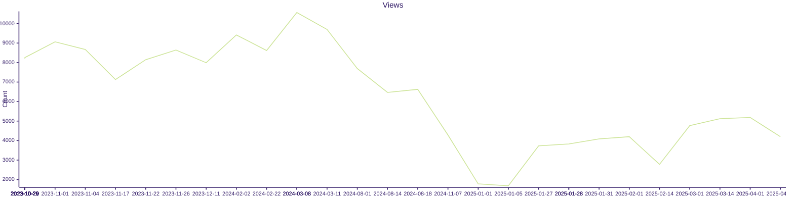
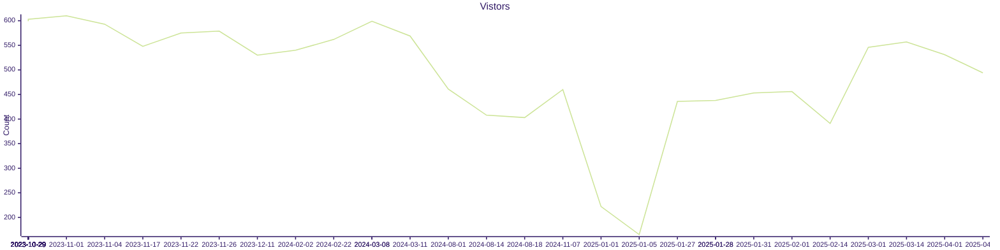

# Repo Traffic

### Repo Page Views

```mermaid
xychart-beta
    title "Views"
    x-axis [2023-10-29,2023-10-29,2023-10-29,2023-10-29,2023-10-29,2023-10-29,2023-10-29,2023-10-29,2023-10-29,2023-10-29,2023-10-29,2023-10-29,2023-10-29,2023-10-29,2023-11-01,2023-11-04,2023-11-17,2023-11-22,2023-11-26,2023-12-11,2024-02-02,2024-02-22,2024-03-08,2024-03-08,2024-03-11,2024-08-01,2024-08-14,2024-08-18,2024-11-07,2025-01-01,2025-01-05,2025-01-27,2025-01-28,2025-01-28,2025-01-31,2025-02-01,2025-02-14,2025-03-01,2025-03-14,2025-04-01,2025-04-14]
    y-axis "Count"
    line [8205,8205,8243,8243,8243,8241,8241,8241,8241,8255,8255,8255,8255,8255,9062,8669,7130,8148,8643,7992,9414,8619,10565,10565,9697,7696,6470,6626,4286,1778,1682,3731,3829,3829,4084,4199,2781,4765,5124,5186,4197]
    %%{init: {
        'theme':'forest', 
        'xyChart': {'width':'2000'}
        }}%%
```

### Repo Unique Visitors

```mermaid
xychart-beta
    title "Vistors"
    x-axis [2023-10-29,2023-10-29,2023-10-29,2023-10-29,2023-10-29,2023-10-29,2023-10-29,2023-10-29,2023-10-29,2023-10-29,2023-10-29,2023-10-29,2023-10-29,2023-10-29,2023-11-01,2023-11-04,2023-11-17,2023-11-22,2023-11-26,2023-12-11,2024-02-02,2024-02-22,2024-03-08,2024-03-08,2024-03-11,2024-08-01,2024-08-14,2024-08-18,2024-11-07,2025-01-01,2025-01-05,2025-01-27,2025-01-28,2025-01-28,2025-01-31,2025-02-01,2025-02-14,2025-03-01,2025-03-14,2025-04-01,2025-04-14]
    y-axis "Count"
    line [599,599,601,601,601,601,601,601,601,603,603,603,603,603,610,593,548,575,579,530,540,562,599,599,569,461,408,403,460,222,165,436,438,438,453,456,391,546,557,531,494]
    %%{init: {
        'theme':'forest', 
        'xyChart': {'width':'2000'}
        }}%%
```