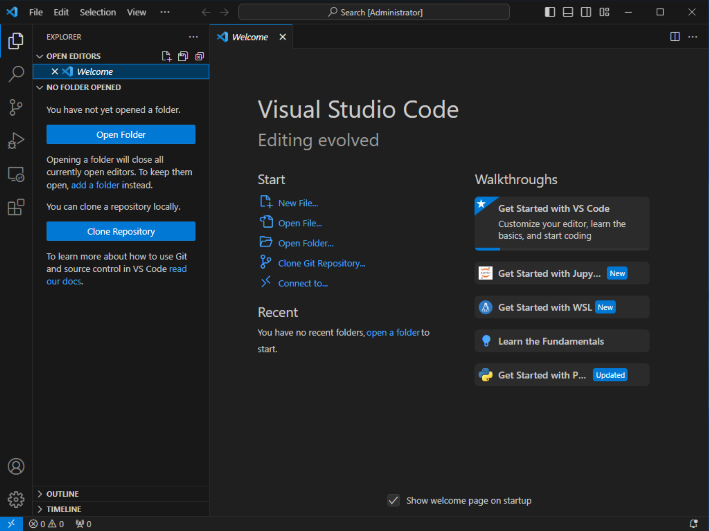
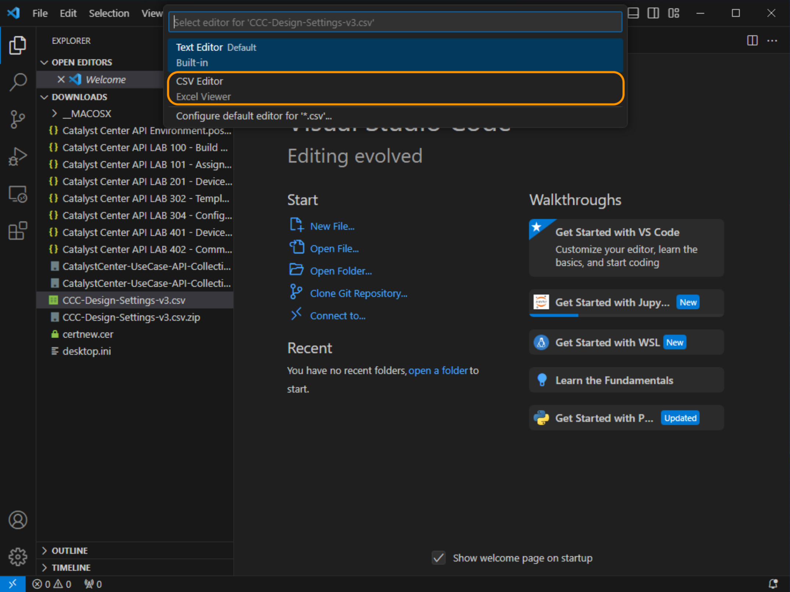

# Postman and External Data Sources

Within Postman, we will utilize the collection `Build Hierarchy` to build out the Hierarchy of Catalyst Center into which we associate `settings` and `discover devices`. 

This Collection may be run whenever you wish to create a new section of the Hierarchy to **add** additional `Areas`, `Buildings`, or `floors`. 

Accompanying the Collection is a **required** Comma Separated Value (CSV) file, which is essentially an `answer file` for the values used to build the design. The CSV may be found here. 

> **Download**: <a href="https://git-link.vercel.app/api/download?url=https://github.com/kebaldwi/DNAC-TEMPLATES/blob/master/CODE/POSTMAN/DEVNET-IGNITE/CCC-Design-Settings-v3.csv" target="_blank">⬇︎ Catalyst Center Design Settings CSV ⬇︎</a>

## Preparing the External Data File

### Preparing Visual Studio Code

We will use **Visual Studio Code** to edit the file, or alternative editor. Open **Visual Studio Code** from the task bar. 



We will the install the CSV Editor, by selecting **Extensions**, searching for `CSV` then clicking **Install** link beside `Excel Viewer`. Once installed we can then **open and edit** the **CSV** for our use.


### Editing the External Data File in Visual Studio Code

Next we will open the extracted CSV file within the download directory. Select the **Explorer** icon on the menu and click **Open Folder** and browse to the `Download` directory and select it. 


Expand the `Downloads` directory in the Explorer page to reveal the file **CCC-Design-Settings-v3.csv**.

Right click the file and select *Open with...* 


Then choose **CSV Editor** from the list at the top of the screen. You should then be able to resize the window and navigate it to paste in the information from the table below **RELEVANT** to **YOUR POD**.



#### POD Specific information

Below are the fields which will need to be edited in your version of the **CSV** file.

|Hierarchy Area|Hierarchy Bldg|Hierarchy Floor|Hierarchy Parent|Hierarchy Bldg Address|Device List|
|--------------|--------------|---------------|----------------|----------------------|-----------|
|POD 0|Building P0|Floor 1|Global/PODS|300 E Tasman Dr, Bldg 10, San Jose, CA 95134|198.18.140.1,198.18.10.2,198.18.20.2|
|POD 1|Building P1|Floor 1|Global/PODS|3850 Zanker Rd, Bldg 1, San Jose, CA 95134  |198.18.141.1,198.18.11.2,198.18.21.2|
|POD 2|Building P2|Floor 1|Global/PODS|3800 Zanker Rd, Bldg 2, San Jose, CA 95134  |198.18.142.1,198.18.12.2,198.18.22.2|
|POD 3|Building P3|Floor 1|Global/PODS|225 E Tasman Dr, Bldg 3, San Jose, CA 95134 |198.18.143.1,198.18.13.2,198.18.23.2|
|POD 4|Building P4|Floor 1|Global/PODS|275 E Tasman Dr, Bldg 4, San Jose, CA 95134 |198.18.144.1,198.18.14.2,198.18.24.2|
|POD 5|Building P5|Floor 1|Global/PODS|325 E Tasman Dr, Bldg 5, San Jose, CA 95134 |198.18.145.1,198.18.15.2,198.18.25.2|
|POD 6|Building P6|Floor 1|Global/PODS|375 E Tasman Dr, Bldg 6, San Jose, CA 95134 |198.18.146.1,198.18.16.2,198.18.26.2|
|POD 7|Building P7|Floor 1|Global/PODS|425 E Tasman Dr, Bldg 7, San Jose, CA 95134 |198.18.147.1,198.18.17.2,198.18.27.2|
|POD 8|Building P8|Floor 1|Global/PODS|3750 Zanker Rd, Bldg 8, San Jose, CA 95134  |198.18.148.1,198.18.18.2,198.18.28.2|
|POD 9|Building P9|Floor 1|Global/PODS|260 E Tasman Dr, Bldg 9, San Jose, CA 95134 |198.18.149.1,198.18.19.2,198.18.29.2|

We will take the information within the table above and fill amend our **CSV** file as needed. For this and subsequent examples we will assume we are using **POD 0** 

#### **Step 1**: Modifying the Hierarchy for the POD **(REQUIRED)**

Lets amend the 3rd line of the CSV with the correct POD information with the following: 

> *Note:* *Modify each field individually*

1. Lets modify the **Hierarchy Area** with the correct POD Number
2. Lets modify the **Hierarchy Building**  
3. Lets modify the **Hierarchy Floor**
4. Lets modify the **Hierarchy Building Address**

So it looks like this but for your **POD**.


#### **Step 2**: Modifying the Device List for the POD **(REQUIRED)**

Lets amend the 3rd line of the CSV with the correct POD information with the following: 

> *Note:* *Modify each field individually*

1. Lets paste the **Device List** as indicated above

So it looks like this but for your **POD**.


We will then **save** the CSV file to view the hierarchy that will be built during the lab. 

As you review the CSV file, you will see each row has hierarchal information, settings, credentials, and other information. **Be Careful NOT to modify the file further**; if you feel you have modified the file incorrectly, please download it again and repeat the process.

The hierarchy the CSV will build will be this:

```text
Global >
Global > PODS
Global > PODS > POD 0 > Building10 > Floor1
```
## Summary

You have set up the Postman client with a collection, the environment, and the settings to complete the Lab. In the following sections, you use environment variables within each collection to perform a task on Catalyst Center.

We have performed a few operations in the client, and you have seen the Collections where the REST APIs are configured and the Environment where the data is stored in variables within the database.

> **Note**: Before you continue, you may take additional time to familiarize yourself with Postman.

> [**Next Module**](../catc-catcenter-1-hierarchy/01-intro.md)

> [**Return to LAB Menu**](../README.md)