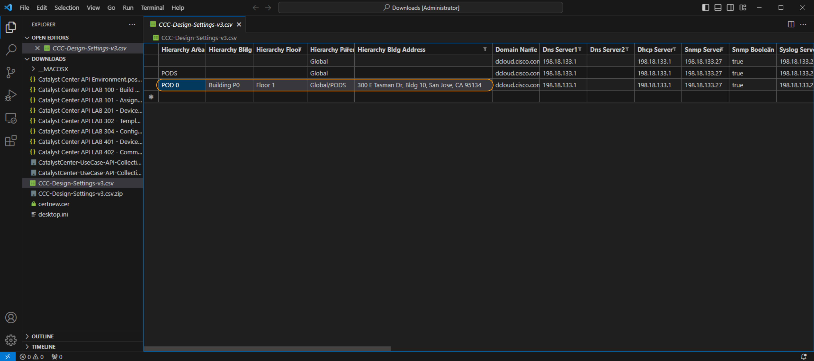

# Device Discovery

In this module, we will use *Postman* to `discover` devices within the network and `assign` them to specific sites within the hierarchy within Cisco Catalyst Center. 

Cisco Catalyst Center uses hierarchy to logically align intent (code and configuration) against infrastructure. This allows the network administrator to align changes and modifications to the network within maintenance windows.

## Device Discovery Background

Cisco Catalyst Center has a Discovery Tool, which allows for the discovery of devices across the network through one of the following methods:

1. CDP
2. LLDP
3. IP Range 

This tool also utilizes credentials for SSH/Telnet/SNMP/HTTPS connections.

Once a device has been discovered, the device is synchronized and deposited within the unassigned space in the inventory. The Administrator then must assign the device to a relevant **site** within the hierarchy. 

In this lab, we will **discover** all the devices within the dCloud lab as specified in the given CSV file. The devices will then be automatically be added to the sites as defined in the CSV. 

> **Note**: If ISE is integrated with Cisco Catalyst Center and settings are applied, then the device is also added as a Network Access Device within ISE during the assignment task via **PxGrid Integration**

> **Prerequisites**: **Completed** the previous section **Assign Settings and Credentials**

## Postman and External Data Sources

Within Postman, we will utilize the collection `Device Discovery` to **discover** network infrastructure `routers`, `switches` and `wireless` network devices and **add** them in order to manage the devices. 

This Collection may be run whenever you wish to configure or discover a `brownfield` device and add it to the inventory of Cisco Catalyst Center. 

Accompanying the Collection is a **required** Comma Separated Value (CSV) file, which is essentially an `answer file` for the values used to build the design which we have previously edited. 

You will have already modified the 3rd line of the **CSV** with the correct POD information with the following: 

So it looks like this but for your **POD** specific information.

> [**RETURN**](../dntd-catcenter-0-orientation/04-externaldata.md)**:** If you have not done so please refer back to the previous section to edit the **CSV** accordingly [**link**](../dntd-catcenter-0-orientation/04-externaldata.md)

> [**Next Section**](./02-deploy.md)

> [**Return to LAB Menu**](../README.md)