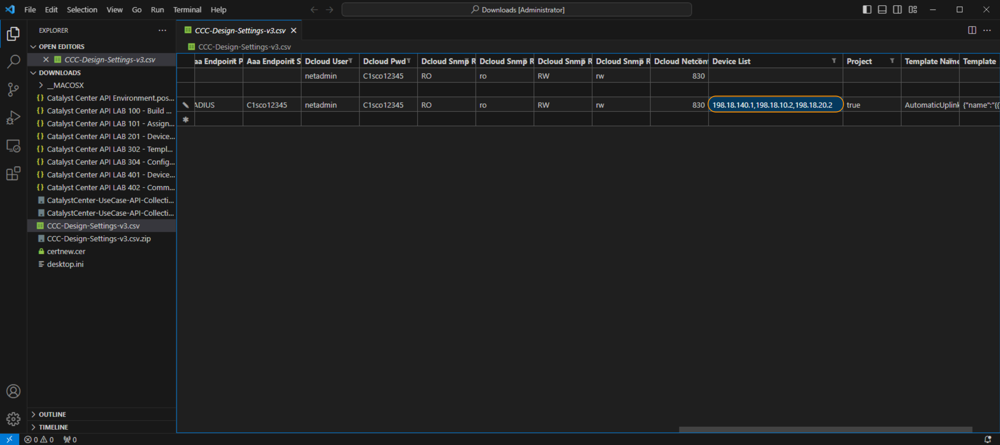

# Template Deployment

In this module, we will use *Postman* to **build** and **deploy** `Projects` and a `Regular Templates` for a specific site within the hierarchy within Cisco Catalyst Center. 

Cisco Catalyst Center uses hierarchy to logically align intent (code and configuration) against infrastructure. This allows the network administrator to align changes and modifications to the network within maintenance windows.

## Template Background

Cisco Catalyst Center has a `Template Hub` which replaced the `Template Editor` in previous versions. This tool allows for the import and export of custom templates written in **Jinja2** or **Velocity** scripting languages. The templates are encapsulated within JSON inside Cisco Catalyst Center.

These templates and associated parameters allow for the `configuration` of devices when associated with the hierarchy through a `Network Profile`. 

`Templates`, both `Regular` and `Composite`, are grouped logically into `Projects`.

In this lab, we will `deploy` a `regular template` within a project to be ready for deployment later. 

> **Note**: Included in the repository is a Deployment API, which is there for informational purposes and should not be invoked due to the nature of the lab environment.

> **Prerequisites**: **Completed** the previous section **Device Discovery**

## Postman and External Data Sources

Within Postman, we will utilize the collection `Template Deployment` to build projects within the `Template Editor` and add `Regular Templates` to them in order to `configure` devices. 

This Collection may be run whenever you wish to `configure` or `modify` the **configuration** of a `device` within Cisco Catalyst Center. 

Accompanying the Collection is a **required** Comma Separated Value (CSV) file, which is essentially an `answer file` for the values used to build the design which we have previously edited. 

You will have already modified the 3rd line of the **CSV** with the correct POD information with the following: 

So it looks like this but for your **POD** specific information.

> [**RETURN**](../dntd-catcenter-0-orientation/04-externaldata.md)**:** If you have not done so please refer back to the previous section to edit the **CSV** accordingly [**link**](../dntd-catcenter-0-orientation/04-externaldata.md)

> [**Next Section**](./02-deploy.md)

> [**Return to LAB Menu**](../README.md)