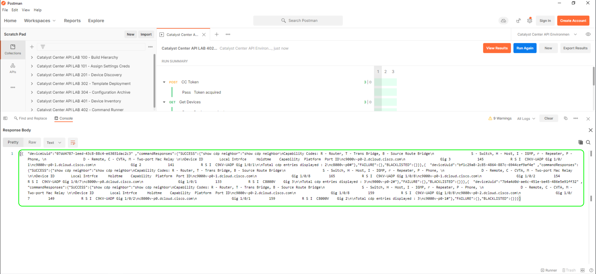

# Using Command Runner

We will now initiate a `show cdp neighbor` command against `c9300-2` managed by Cisco Catalyst Center using the Rest-API within the collection `Catalyst Center API LAB 402 - Command Runner`

Follow these steps:

## Open the collection runner

Navigate and open the desired collection runner through the following:

   1. Within Postman, click on the collection shortcut in the sidebar
   2. Hover over the collection `Catalyst Center API LAB 402 - Command Runner`
   3. Click the `Run Collection` submenu option

      

## Run the collection

To run the collection, do the following:

   1. Ensure all the sub-components of the `Runner` are selected
   2. Select the `Save Responses` option as we will need the output
   3. Click `Select file`, then select the `CSV` by clicking `Open`
   4. Click  the `Run Catalyst Center API LAB 402 - Command Runner` button

      

## View the results

1. The following results will slowly appear as the collection is processed.

   1. Click `View Results` on the Left
   2. Watch the Results slowly appear. The API has been set up to give device info in the test area.

      

2. To view the results, do the following:

   1. Click the `Console` option at the bottom of postman
   2. Expand the Get request that begins `GET https://198.18.129.100/dna/intent/api/v1/file/...` 
   3. Within the `Response Body` click the `Pop out` arrow and view the Response

      

      

## Summary

We have been able to run diagnostic commands via Rest-API, which is useful if we want to get any `show` command or output from any diagnostic command to a third-party system. This allows us to augment Cisco Catalyst Center and create whatever we like regarding troubleshooting support for other platforms like ServiceNow or other 3rd party Rest-API-based ITSM tools. 

> **Note**: Additionally, if there is time, look at the pre and post-scripts within Postman.

> [**Return to LAB Menu**](../README.md)

> [**Return to LAB Main Menu**](../../README.md)