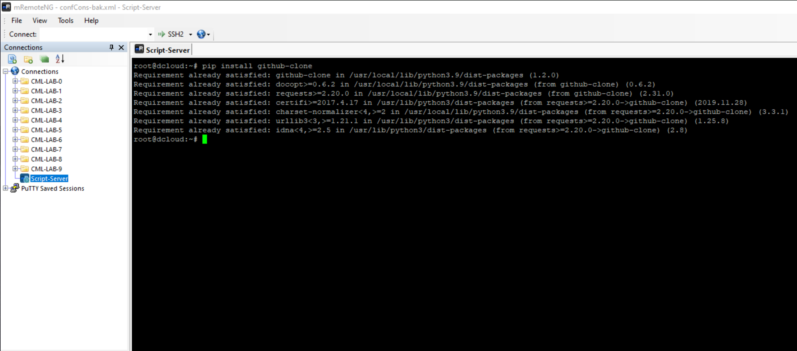
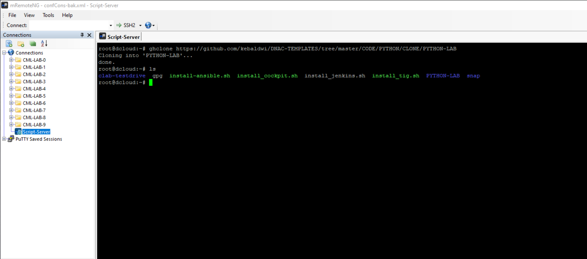
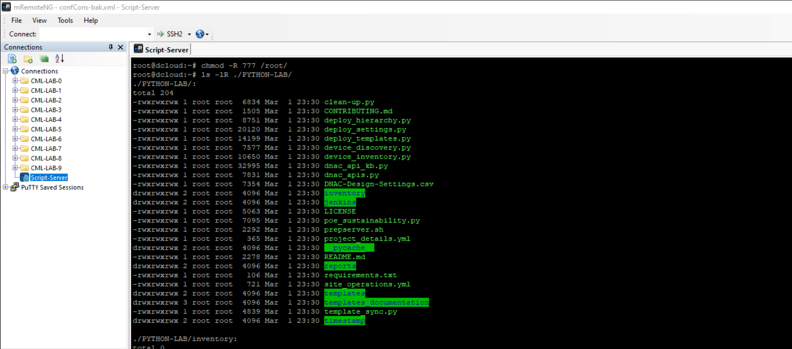

## Verification of Environment

Prior to beginning we need to ensure the environment is functioning correctly. Due to the nature of the lab there ar co-dependancies that we must ensure are aligned.

Follow these steps:

On the script server send the following commands:

```SHELL
python --version && pip3 --version
```
We should see this desired output

<p align="center"></p>

## Git Pull of Lab Content

We will use a clone of a specific subfolder from `DNAC-Templates` for this section of the lab.

1. In preparation from the working home directory folder `cd ~` issue the following command:

```SHELL
pip install PyGithub
pip install github-clone
```

<p align="center"></p>

2. Once the package has installed issue the following command to clone the specific subfolder to make things easier in the lab:

```SHELL
ghclone https://github.com/kebaldwi/DNAC-TEMPLATES/tree/master/CODE/PYTHON/CLONE/PYTHON-LAB
```
<p align="center"></p>

3. We will now ensure that Jenkins has full access to this folder

```SHELL
chmod -R 777 /root/
```

4. To ensure all the required files are there issue an `ls -lR ./PYTHON-LAB` and confirm:

<p align="center"></p>

> [**Next Section**](./06-setuplab.md)