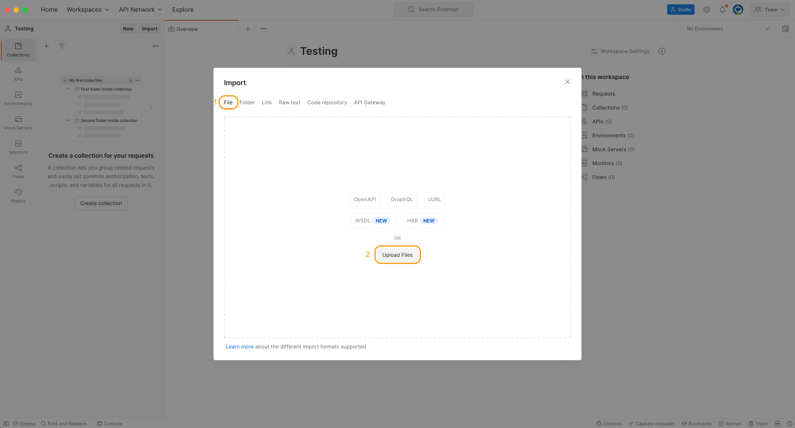
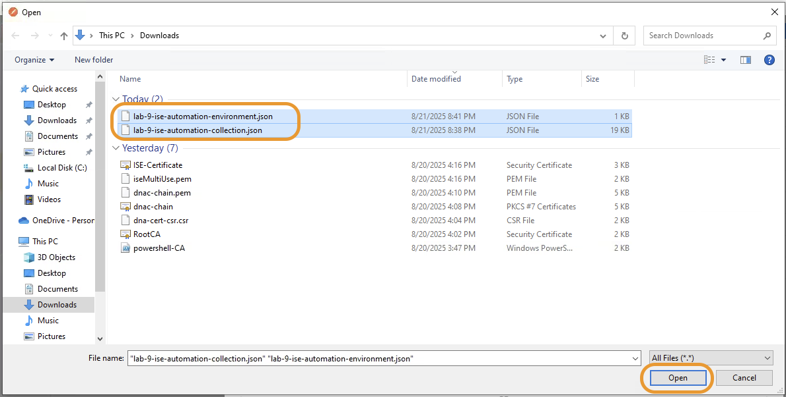
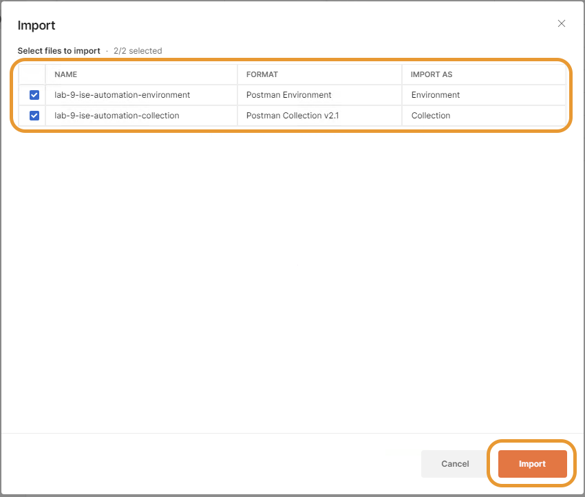
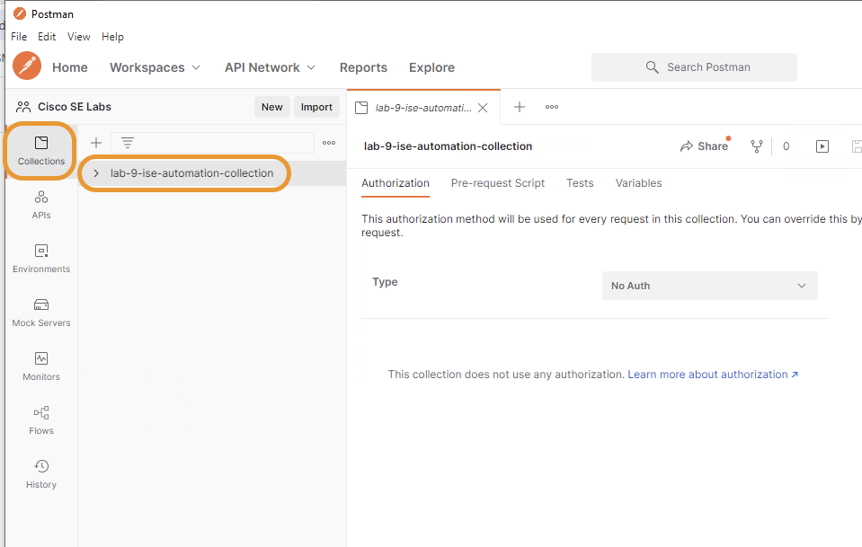
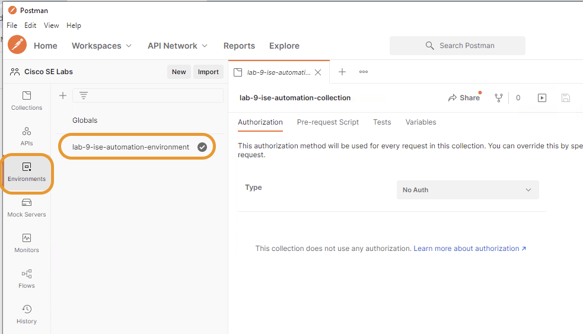
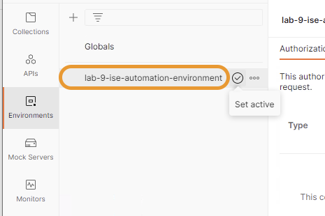
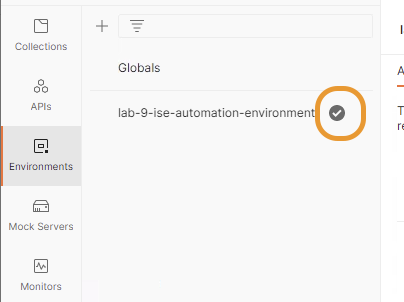
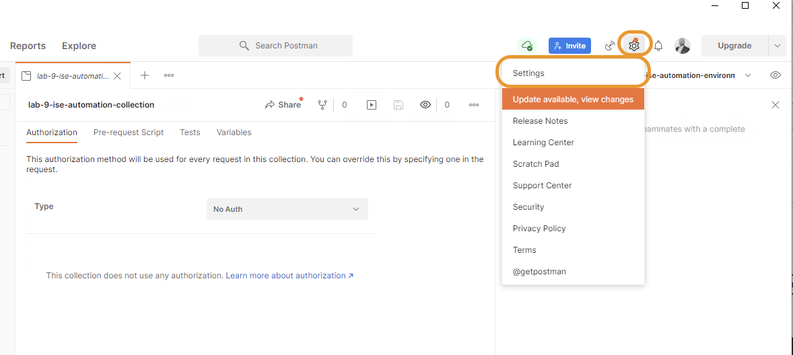

# Preparing Postman for use with ISE

To use Postman with ISE, we import the collection and environment into our workspace.

## Postman Collection and Environment Import

To prepare Postman for the lab, please download the following collection and environment files and upload them into Postman. To do this right, click and open this link in a new tab to download them:

***Downloads***
   
<a href="https://git-link.vercel.app/api/download?url=https://github.com/kebaldwi/DNAC-TEMPLATES/blob/master/CODE/POSTMAN/lab-9-ise-automation-collection.json">⬇︎COLLECTION⬇︎</a>

   
<a href="https://git-link.vercel.app/api/download?url=https://github.com/kebaldwi/DNAC-TEMPLATES/blob/master/CODE/POSTMAN/lab-9-ise-automation-environment.json">⬇︎ENVIRONMENT⬇︎</a>

Follow these steps:

1. Click on the Postman shortcut on the desktop.

   

2. Click **Import**. A window for importing files appears.

   

3. Click **Upload File** to begin the file select process.

   

4. Select the files from the Student Folder and click **Open**.

   

5. Postman shows a list of files ready for import. Click **Import**.

   

6. Confirm the Collection is present.

   

7. Confirm that the environment is present.

   

## Postman Environment Variables

Next, set up the client with the correct environment variables and SSL settings.

To ensure uniformity across all calls made from the client when we use different collections, we use Environmental Variables. These variables form a database that can be used in many collections. Also, the variables enable you to build specific collections for many functions to devote them to specific use cases.

1. Navigate to the environment on the left sidebar.

2. Hover over the environment in the list. Notice a box to set it to **Active**.

   

3. Select the check box.

   

> **Note**: This environment is pre-populated with the information to build ISE. At specific points in the lab, we will **customize** it for **your use**.

## SSL Settings and Disabling Validation

For Lab purposes, ISE uses a self-signed certificate. This certificate may fail a validation precheck. Disable this setting to proceed with the Lab.

1. Click the Settings gear icon on the top right of Postman.

   

2. In the Settings window, deselect **SSL certificate verification**.

    

3. Close the settings window.

> [**Next Section**](./04-externaldata.md)

> [**Return to LAB Menu**](../README.md)