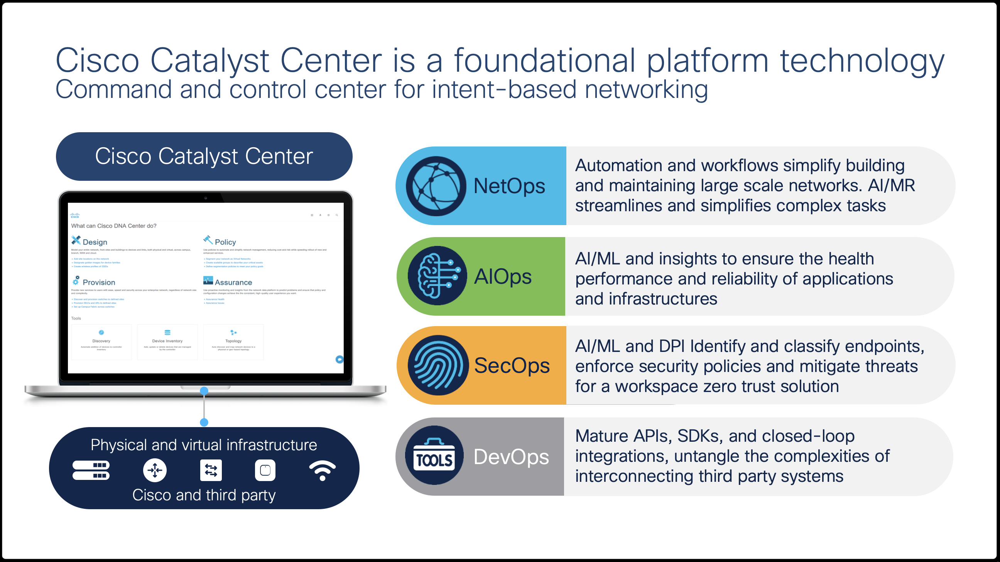

# Introduction to REST API and Postman

## Overview

This set of Cisco Learning Labs is developed to help illustrate the ability to provide an environment of **Continuous Integration** and **Continuous Delivery**. In an ever changing and demanding world we have constant changes in platforms, software and demands placed on both the network and delivery teams to execute. 

**Continuous Integration/Continuous Delivery,** or **Continuous Deployment**, pipelines have been used in the software development industry for years. For most teams, the days of manually taking source code and manifest files and compiling them to create binaries or executable files and then manually distributing and installing those applications are long gone. In an effort to automate the build process and distribution of software as well as perform automated testing, the industry has continuously evolved towards more comprehensive pipelines.
 
Depending on how much of the software development process is automated, pipelines can be categorized into different groups and stages:

Continuous Integration
The practice of integrating code that is being produced typically by developers and utililizes central repositories using a git based version control system. Code is merged into a branch on the needs of the team. Simple to complex tests are used to validate the changes and flush out potential bugs. When performed in an automated fashion, all these steps consist in a continuous integration pipeline.

Continuous Delivery 
Continuous Delivery adds additional testing and has the option to deploy the newly built software packages in a sandbox or stage environment for close monitoring and additional user testing. Similar to continuous integration, all steps performed in the continuous delivery part of the pipeline are automated.

Continuous Deployment
Continuous Deployment stage takes care of deploying the application in the production environment. Several different deployment strategies are available with different risk factors, cost considerations and complexity. 

Deployment Models
Basic Deployment Model, all application nodes are updated at the same time to the new version. While this deployment model is simple it is also the riskiest, it is not outage-proof and does not provide easy rollbacks. 

Rolling Deployment Model as the name suggests takes an incremental approach to updating the application nodes. A certain number of nodes are updated in batches. This model provides easier rollback, it is less risky than the basic deployment but at the same time requires that the application runs with both new and old code at the same time. In applications that use the micro-services architecture, this last requirement must be given extra attention. 

Several other deployment models are available, including Canary, Blue/Green, A/B, etc.

a set of simple use cases to show both the power of Cisco DNA Center, REST APIs, and easy methodologies for execution through a combination of Python and Jenkins.

These Labs are designed for the Cisco dCloud - Enterprise Network Sandbox Lab. It was developed in version 4, which includes Cisco DNA Center 2.2.3.5 and equipment running at least 17.x versions of code.

## Cisco DNA Center

Cisco DNA Center is an intelligent Automation and Assurance platform for the campus. Cisco DNAC enables, simplified Day-0 through Day-N management of switching, routing, and wireless infrastructure. It also improves operations with AI/ML-enhanced analytics to streamline troubleshooting and provide actionable insights into the health of the network and the quality of experience for users and applications. Here are some of the capabilities of Cisco DNAC in their respective domains:

* NetOps: Network Plug and Play for Zero Touch Deployment, Software Image Management, Compliance, Configuration Templates and Network Profiles, Model-Driven Configuration, and RMA Support.
* AIOps: AI/ML-enhanced monitoring and troubleshooting support. Predictive Insights, Network Baselines, Network Reasoner, Device/Client/Application 360, Intelligent Capture.
* SecOps: AI Endpoint Analytics, Group-Based Policy and Analytics, Software-Defined Access
* DevOps: ITSM Integrations, APIs, SDK & Ansible Module 

## Use Case Lab Approach

These Labs are organized as use cases, and each use case has an associated API Collection.

1. Building a Hierarchy
2. Defining Settings and Credentials
3. Device Discovery
4. Deploying Projects and Templates
5. Downloading Configuration Archives
6. Retrieving Network Inventory
7. Running Show Commands

## Prerequisites

To effectively run the Labs, install the following tools on your computer:

> **NOTE**: Cisco AnyConnect VPN Client is **Required** to connect your workstation to Cisco dCloud. You can download it from the [AnyConnect Download Site](https://dcloud-rtp-anyconnect.cisco.com). For more information, refer to the [dCloud AnyConnect Documentation](https://dcloud-cms.cisco.com/help/android_anyconnect).

> **NOTE**: Postman which is an API platform for building and using APIs will be **Required**. Download it from [the Postman website](https://www.postman.com/downloads/).

> **NOTE**: Google Chrome is **Recommended** for working in the Cisco DNA Center UI in these Labs. Download it from the [Chrome website](https://www.google.com/chrome/downloads/).

> [**Next Section**](02-collections.md)