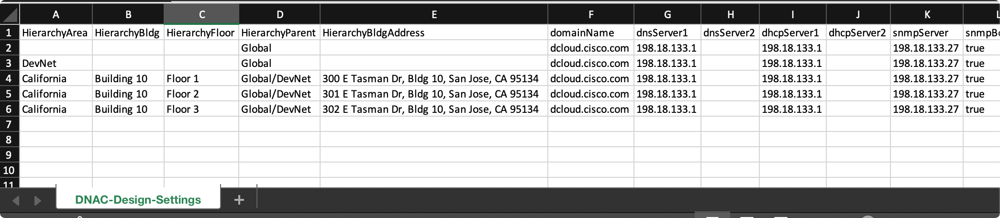

# Python and External Data Sources

We will utilize the Python program **deploy_hierarchy.py** to build out the Hierarchy of Cisco DNA Center into which we later will associate **settings** and **discover devices**. 

This Collection may be run whenever you wish to create a new section of the Hierarchy to **add** additional **Areas**, **Buildings**, or **floors**. 

Accompanying the **Python Program** is a **required** Comma Separated Value (CSV) file, which is essentially an **answer file** for the values used to build the design. The CSV which was pulled in the **Git Clone** may be found here: 

> **Download:** <a href="https://minhaskamal.github.io/DownGit/#/home?url=https://github.com/kebaldwi/DNAC-TEMPLATES/tree/master/LABS/LAB-L-CICD-Orchestration/assets/csv/DNAC-Design-Settings.csv" target="_blank">⬇︎ Cisco DNA Center Design Settings CSV ⬇︎</a>

> **IMPORTANT NOTE:** We will **open** but **not save** the CSV file to view the hierarchy that will be built during the lab. 
  As you review the CSV file, you will see each row has hierarchal information, settings, credentials, and other information. **Be Careful NOT to modify the file**; if you feel you have modified the file, please download it again.

To view the file on the **script server** do the following:

```SHELL
cat /root/DEVWKS-2176/DNAC-Design-Settings.csv
```

<p align="center"></p>

The hierarchy the CSV will build will be this:

```text
Global > DevNet
Global > DevNet > California > Building 10 > Floor 1
Global > DevNet > California > Building 10 > Floor 2
Global > DevNet > California > Building 10 > Floor 3
```

> [**Next Section**](./04-pipeline.md)
