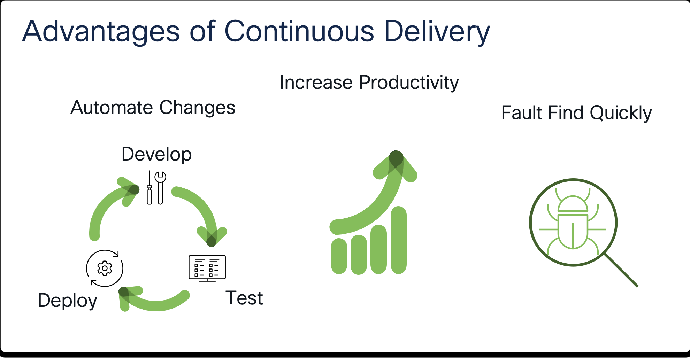
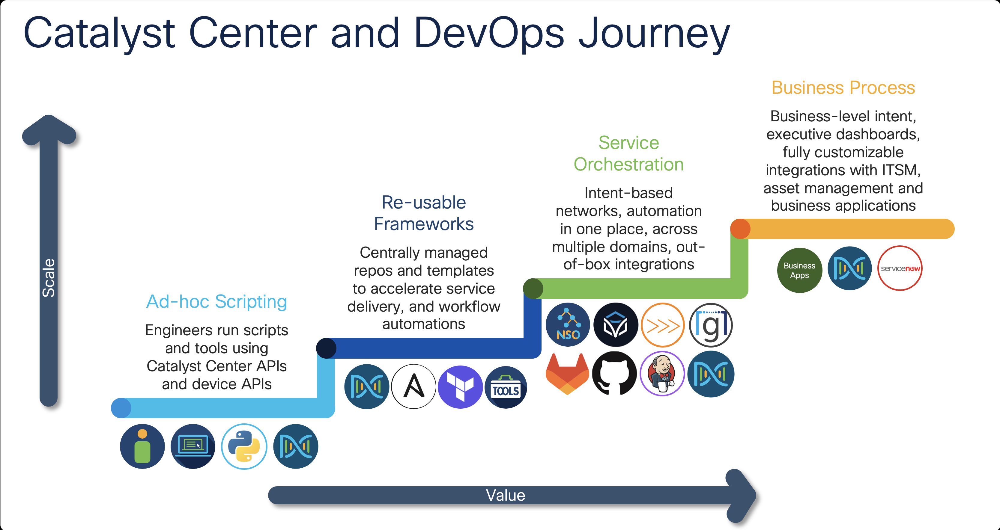

# CI/CD Orchestration Cisco Catalyst Center 

## Overview

In the world of Continuous Integration and Continuous Deployment (CI/CD), orchestration platforms play a crucial role in automating software development processes. These platforms enable teams to streamline their workflows, improve collaboration, and ensure the seamless delivery of software applications. Among the most popular orchestration platforms are Jenkins, GitHub, and GitLab. In this tutorial, we will explore the features, benefits, and differences of these platforms. Additionally, we will delve into the support for REST APIs in Python and Ansible, highlighting their unique advantages. Lastly, we will discuss the concept of pipelines, their functionality, and how they can be triggered.

**Continuous Integration/Continuous Delivery,** or **Continuous Deployment**, pipelines have been used in the software development industry for years. For most teams, the days of manually taking source code and manifest files and compiling them to create binaries or executable files and then manually distributing and installing those applications are long gone. In an effort to automate the build process and distribution of software as well as perform automated testing, the industry has continuously evolved towards more comprehensive pipelines.

Depending on how much of the software development process is automated, pipelines can be categorized into different groups and stages:

### Continuous Integration

The practice of integrating code that is being produced typically by developers and utililizes central repositories using a git based version control system. Code is merged into a branch on the needs of the team. Simple to complex tests are used to validate the changes and flush out potential bugs. When performed in an automated fashion, all these steps consist in a continuous integration pipeline.

### Continuous Delivery

Continuous Delivery adds additional testing and has the option to deploy the newly built software packages in a sandbox or stage environment for close monitoring and additional user testing. Similar to continuous integration, all steps performed in the continuous delivery part of the pipeline are automated.

### Continuous Deployment

Continuous Deployment stage takes care of deploying the application in the production environment. Several different deployment strategies are available with different risk factors, cost considerations and complexity. 

### Deployment Models

**Basic Deployment Model**, all application nodes are updated at the same time to the new version. While this deployment model is simple it is also the riskiest, it is not outage-proof and does not provide easy rollbacks. 

**Rolling Deployment Model** as the name suggests takes an incremental approach to updating the application nodes. A certain number of nodes are updated in batches. This model provides easier rollback, it is less risky than the basic deployment but at the same time requires that the application runs with both new and old code at the same time. In applications that use the micro-services architecture, this last requirement must be given extra attention. 

Several other deployment models are available, including Canary, Blue/Green, A/B, etc.

## Orchestration Platforms in CI/CD

There are various Orchestrators which may be aligned to Orchestrating over Automation Engines otherwise known as Controllers within the Network Management layers. You can see some of them here.

They are:
- **Network Service Orchestrator NSO** *- Cisco Systems Inc*
- **iTenial** *- Cisco Systems*
- **nAutoBot** *- Network 2 Code*
- **Gluware** *- Gluware*
- **GitLab** *- GitLab*
- **GitHub** *- GitHub a division of Microsoft*
- **Jenkins** *- Jenkins*
- **Cisco Catalyst Center** *- Cisco Systems*

### Jenkins

Jenkins is an open-source automation server that facilitates the CI/CD process by automating various tasks such as building, testing, and deploying software applications. It provides a wide range of plugins and integrations, making it highly customizable and adaptable to different development environments. Jenkins supports multiple programming languages and version control systems, making it a versatile choice for CI/CD pipelines.

Key Benefits of Jenkins:

1. Extensibility: Jenkins offers a vast collection of plugins that enable users to integrate with various tools and technologies. This extensibility allows teams to tailor their CI/CD workflows according to their specific requirements.

2. Easy Integration: Jenkins seamlessly integrates with popular version control systems like Git, enabling developers to trigger builds automatically whenever changes are pushed to the repository. This integration ensures that the latest code is always tested and deployed.

3. Distributed Architecture: Jenkins supports distributed builds, allowing teams to scale their CI/CD infrastructure across multiple machines. This scalability ensures faster build times and efficient resource utilization.

### GitHub

GitHub is a web-based platform for version control and collaboration that enables developers to host and manage their Git repositories. While primarily known as a code hosting platform, GitHub also offers robust features for CI/CD workflows through its Actions functionality. Actions allow developers to automate tasks directly within GitHub, eliminating the need for external CI/CD tools.

Key Benefits of GitHub:

1. Seamless Collaboration: GitHub provides a centralized platform for developers to collaborate on code, review changes, and track issues. This collaborative environment fosters efficient teamwork and enhances code quality.

2. Integrated CI/CD: With GitHub Actions, developers can define custom workflows that automate tasks like building, testing, and deploying applications. These workflows can be triggered by events such as push events, pull requests, or scheduled intervals.

3. Marketplace: GitHub has an extensive marketplace where users can find pre-built Actions for various CI/CD tasks. This marketplace simplifies the setup process by offering a wide range of plugins and integrations.

### GitLab

GitLab is a web-based DevOps platform that provides a complete end-to-end solution for the software development lifecycle. It combines robust version control capabilities with built-in CI/CD functionalities. GitLab offers both a cloud-based SaaS solution and a self-hosted option, giving teams flexibility in choosing their deployment model.

Key Benefits of GitLab:

1. All-in-One Solution: GitLab integrates version control, issue tracking, CI/CD pipelines, and more into a single platform. This consolidation reduces complexity and improves efficiency by eliminating the need for multiple tools.

2. Comprehensive CI/CD: GitLab's CI/CD pipelines enable teams to define complex workflows with multiple stages and parallel execution. It supports automatic testing, code quality analysis, and deployment to various environments.

3. Kubernetes Integration: GitLab has native integration with Kubernetes, a popular container orchestration platform. This integration allows seamless deployment of applications to Kubernetes clusters, simplifying the management of containerized environments.

## Support for REST APIs

REST APIs (Representational State Transfer Application Programming Interfaces) provide a standardized way for different software systems to communicate with each other over the internet. Python and Ansible offer robust support for working with REST APIs, albeit with different approaches.

### Python

Python is a versatile programming language that provides extensive libraries and frameworks for developing REST API clients. The most commonly used library for making API requests in Python is `requests`. It offers a simple yet powerful interface for sending HTTP requests, handling responses, and parsing JSON data.

Benefits of Python for REST API Integration:

1. Readability and Simplicity: Python's syntax is highly readable and expressive, making it easy to understand and work with REST APIs. The `requests` library provides a straightforward API that abstracts away the complexities of HTTP communication.

2. Rich Ecosystem: Python has a vast ecosystem of third-party libraries and frameworks that complement REST API development. These libraries offer additional functionalities such as authentication, caching, and error handling.

### Ansible

Ansible is an open-source automation tool that focuses on configuration management, application deployment, and task orchestration. While Ansible is not primarily designed for working with REST APIs, it provides modules that facilitate API integration within automation playbooks.

Benefits of Ansible for REST API Integration:

1. Infrastructure as Code: Ansible allows developers to define infrastructure configurations as code using YAML files called playbooks. This declarative approach makes it easy to manage REST API interactions alongside other automation tasks.

2. Idempotent Operations: Ansible's idempotent nature ensures that API calls are executed only when necessary, preventing redundant operations. This feature enhances the reliability and predictability of REST API interactions.

## Pipelines

Pipelines are a fundamental concept in CI/CD that define the steps required to build, test, and deploy software applications. They provide a visual representation of the entire workflow, enabling teams to automate complex processes and ensure consistent delivery.

### How Pipelines Work

Pipelines consist of multiple stages or steps that are executed sequentially or in parallel. Each stage represents a specific task such as building code, running tests, or deploying applications. Pipelines define dependencies between stages and allow conditional execution based on specific criteria.

### Triggering Pipelines

Pipelines can be triggered by various events such as code commits, pull requests, or manual triggers. When an event occurs, the pipeline engine executes the defined stages in the specified order. Notifications and status updates are typically sent to relevant stakeholders throughout the pipeline execution.

## Summary

In conclusion, orchestration platforms like Jenkins, GitHub, and GitLab are essential tools in modern CI/CD workflows. Each platform offers unique features and benefits that cater to different development needs. Additionally, Python and Ansible provide robust support for working with REST APIs, enabling seamless integration with external systems. Lastly, pipelines provide a structured approach to automating software delivery processes by defining clear steps and dependencies. By leveraging these platforms and concepts effectively, development teams can achieve faster time-to-market, improved collaboration, and higher-quality software products.

> **Feedback:** If you found this repository please fill in comments and [**give feedback**](https://app.smartsheet.com/b/form/f75ce15c2053435283a025b1872257fe) on how it could be improved.

> [**Return to Main Menu**](./README.md)